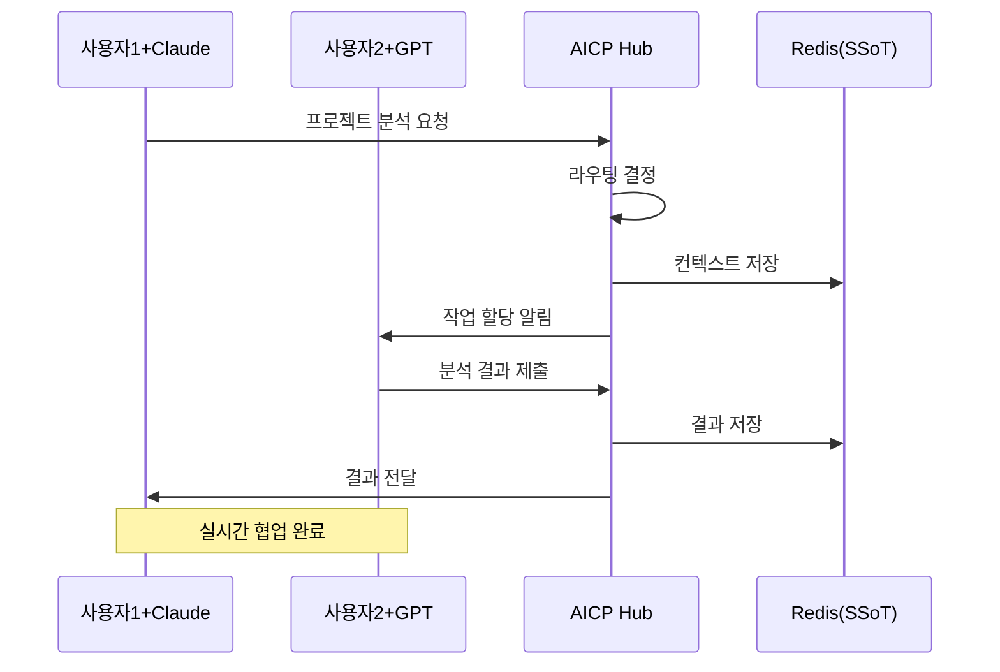

# AICP - AI Inter-Communication Protocol

[English](README.md) | [한국어](README.ko.md) | [中文](README.zh.md)

[](https://opensource.org/licenses/MIT)
[](https://www.python.org/downloads/)
[](https://modelcontextprotocol.io)
[](https://www.docker.com/)
[]()

> 인터넷이 정보의 벽을 허물었다면, 우리는 지능의 인터넷을 만듭니다.

## 🌐 소개

AICP(AI Inter-Communication Protocol)는 서로 다른 LLM과 사용자가 하나의 네트워크에서 자유롭게 협업할 수 있도록 하는 오픈 프로토콜입니다. MCP(Model Context Protocol) 호환으로 기존 LLM 서비스에서 바로 사용 가능합니다.

### 🎯 핵심 차별점

- **MCP (Model Context Protocol)**: LLM ↔ 도구/데이터 연결
- **ACP (Agent Communication Protocol)**: AI ↔ AI 직접 통신  
- **AICP (우리의 혁신)**: [사용자+LLM] ↔ [사용자+LLM] 네트워크

## ✨ 주요 특징

- 🔌 **MCP 호환**: Claude, ChatGPT 등에서 즉시 사용 가능
- 💰 **비용 효율적**: API 키 없이 기존 LLM 구독만으로 이용
- 🚀 **쉬운 배포**: Docker Compose 한 줄로 실행
- 🔒 **보안 강화**: JWT 인증, TLS/SSL 지원
- 📊 **실시간 모니터링**: Prometheus + Grafana 대시보드
- 🤖 **지능형 라우팅**: 작업에 최적화된 AI 자동 선택

## 🏗️ 아키텍처

### 핵심 개념: 지능의 네트워크

AICP는 단순한 AI 도구 연결이 아닌, **사용자들이 각자의 LLM을 통해 연결되는 지능 네트워크**를 구현합니다.

```
        [사용자 A + Claude]          [사용자 B + GPT-4]
                │                            │
                └──────────┬─────────────────┘
                           │
                    ┌──────▼──────┐
                    │  AICP Hub   │
                    │ (Neural Bus)│
                    └──────┬──────┘
                           │
                ┌──────────┴─────────────────┐
                │                            │
        [사용자 C + Gemini]          [사용자 D + Claude]
```

### 상세 아키텍처

```
┌──────────────────────────────────────────────────────────┐
│                    사용자 네트워크 레이어                    │
├──────────────────────────────────────────────────────────┤
│  사용자 A                사용자 B              사용자 C    │
│     ↓                      ↓                     ↓       │
│  Claude                 ChatGPT              Gemini      │
└─────┬──────────────────────┬────────────────────┬────────┘
      │                      │                    │
      └──────────────────────┼────────────────────┘
                             │
                    MCP WebSocket Protocol
                             │
┌─────────────────────────────▼────────────────────────────┐
│                    AICP Neural Bus                       │
│                                                          │
│  ┌──────────────────────────────────────────────────┐   │
│  │           🧠 지능형 라우팅 엔진                    │   │
│  │                                                  │   │
│  │  • 사용자 의도 분석                               │   │
│  │  • 최적 AI 에이전트 매칭                          │   │
│  │  • 부하 분산 및 QoS 관리                         │   │
│  └──────────────────────────────────────────────────┘   │
│                                                          │
│  ┌──────────────────────────────────────────────────┐   │
│  │           🔄 협업 오케스트레이션                   │   │
│  │                                                  │   │
│  │  • 다중 사용자 세션 관리                          │   │
│  │  • 실시간 메시지 브로드캐스팅                      │   │
│  │  • 작업 분배 및 동기화                           │   │
│  └──────────────────────────────────────────────────┘   │
│                                                          │
│  ┌──────────────────────────────────────────────────┐   │
│  │           💾 공유 상태 허브 (SSoT)                │   │
│  │                                                  │   │
│  │  • 전역 컨텍스트 저장소                          │   │
│  │  • 사용자 간 데이터 공유                         │   │
│  │  • 실시간 상태 동기화                           │   │
│  └──────────────────────────────────────────────────┘   │
└──────────────────────┬───────────────────────────────────┘
                       │
         ┌─────────────┴─────────────┐
         │                           │
    ┌────▼────┐              ┌──────▼──────┐
    │  Redis  │              │  PostgreSQL │
    │ (Cache) │              │  (Persist)  │
    └─────────┘              └─────────────┘
```

### 네트워크 통신 흐름



### 주요 구성 요소

#### 1. **사용자-LLM 쌍 (User-LLM Pair)**
- 각 사용자는 자신의 LLM을 "개인 에이전트"로 보유
- MCP 클라이언트를 통해 AICP 네트워크에 연결
- 독립적인 세션 관리 및 인증

#### 2. **Neural Bus (지능형 중앙 허브)**
- **라우팅 엔진**: 메시지를 최적의 사용자-LLM 쌍으로 전달
- **오케스트레이터**: 복잡한 작업을 여러 참여자에게 분배
- **상태 관리자**: 모든 참여자가 공유하는 컨텍스트 관리

#### 3. **통신 프로토콜**
- **MCP 호환**: 기존 LLM 서비스와 즉시 연동
- **WebSocket**: 실시간 양방향 통신
- **JSON-RPC**: 표준화된 메시지 형식

#### 4. **데이터 레이어**
- **Redis**: 실시간 세션 데이터 및 캐싱
- **PostgreSQL**: 영구 데이터 저장 (선택사항)
- **Event Bus**: 실시간 이벤트 전파

## 🚀 빠른 시작

### 필수 요구사항

- Docker & Docker Compose
- Python 3.11+ (선택사항)
- Git

### 설치 및 실행

```bash
# 1. 저장소 클론
git clone https://github.com/your-username/AICP-Protocol.git
cd AICP-Protocol

# 2. 설치 스크립트 실행
chmod +x setup-aicp.sh
./setup-aicp.sh

# 3. 서비스 확인
docker ps
curl http://localhost:8080/health
```

### 수동 실행 (Docker Compose)

```bash
# 기본 실행
docker-compose up -d

# 전체 스택 실행 (모니터링 포함)
docker-compose -f docker/docker-compose.secure.yml --profile monitoring up -d
```

## 📖 사용 방법

### 1. WebSocket 연결 테스트

```python
import asyncio
import websockets
import json

async def test_connection():
    uri = "ws://localhost:8765/mcp"
    async with websockets.connect(uri) as ws:
        # Initialize
        await ws.send(json.dumps({
            "jsonrpc": "2.0",
            "id": 1,
            "method": "initialize",
            "params": {"clientInfo": {"name": "test", "version": "1.0"}}
        }))
        response = await ws.recv()
        print("Connected:", response)

asyncio.run(test_connection())
```

### 2. AI 라우팅 사용

```python
# 최적의 AI 에이전트 선택
await ws.send(json.dumps({
    "jsonrpc": "2.0",
    "id": 2,
    "method": "tools/call",
    "params": {
        "name": "route_to_agent",
        "arguments": {
            "message": "복잡한 데이터 분석이 필요합니다",
            "target_capabilities": ["analysis", "reasoning"]
        }
    }
}))
```

### 3. 컨텍스트 공유

```python
# AI 간 컨텍스트 공유
await ws.send(json.dumps({
    "jsonrpc": "2.0",
    "id": 3,
    "method": "tools/call",
    "params": {
        "name": "share_context",
        "arguments": {
            "context_key": "project_status",
            "context_value": {"phase": "development", "progress": 75}
        }
    }
}))
```

## 🛠️ MCP 도구 목록

| 도구 이름 | 설명 | 파라미터 |
|---------|------|---------|
| `route_to_agent` | 최적의 AI 에이전트로 메시지 라우팅 | `message`, `target_capabilities`, `context` |
| `share_context` | 에이전트 간 컨텍스트 공유 | `context_key`, `context_value` |
| `orchestrate_collaboration` | 다중 에이전트 협업 조정 | `task`, `agents` |

## 📊 모니터링

- **헬스체크**: `http://localhost:8080/health`
- **메트릭**: `http://localhost:8080/metrics`
- **Prometheus**: `http://localhost:9090` (선택사항)
- **Grafana**: `http://localhost:3001` (선택사항)

## 🔧 설정

### 환경 변수

```bash
# MCP 서버 설정
HOST=0.0.0.0
PORT=8765
HTTP_PORT=8080

# Redis 설정
REDIS_URL=redis://redis:6379/0

# 로깅
LOG_LEVEL=INFO

# 보안 (프로덕션)
JWT_REQUIRED=true
JWT_SECRET=your-secret-key
```

### Docker Compose 프로파일

```bash
# 데이터베이스 포함
docker-compose --profile db up -d

# 모니터링 포함
docker-compose --profile monitoring up -d

# 프록시 포함
docker-compose --profile proxy up -d
```

## 📁 프로젝트 구조

```
AICP-Protocol/
├── aicp/                    # 핵심 라이브러리
│   ├── __init__.py
│   ├── mcp_server.py       # MCP 서버 구현
│   ├── neural_bus.py       # 라우팅 엔진
│   ├── shared_state.py     # SSoT 구현
│   └── security.py         # 보안 모듈
├── docker/                  # Docker 설정
│   ├── Dockerfile.mcp
│   ├── docker-compose.secure.yml
│   └── nginx/              # 프록시 설정
├── examples/               # 사용 예제
│   ├── basic_routing.py
│   └── collaboration.py
├── tests/                  # 테스트
├── docs/                   # 문서
├── scripts/                # 유틸리티
├── setup-aicp.sh          # 설치 스크립트
├── requirements.txt        # Python 의존성
└── README.md              
```

## 🧪 테스트

```bash
# 단위 테스트
python -m pytest tests/

# 통합 테스트
python examples/basic_routing.py
python examples/collaboration.py

# 부하 테스트
python tests/load_test.py
```

## 🔒 보안

- **JWT 인증**: 프로덕션 환경에서 필수
- **TLS/SSL**: NGINX 프록시를 통한 암호화
- **Rate Limiting**: 세션별 요청 제한
- **Docker Secrets**: 민감한 정보 관리

자세한 내용은 [SECURITY.md](docs/SECURITY.md) 참조

## 🤝 기여하기

기여를 환영합니다! 다음 단계를 따라주세요:

1. Fork the Project
2. Create your Feature Branch (`git checkout -b feature/AmazingFeature`)
3. Commit your Changes (`git commit -m 'Add some AmazingFeature'`)
4. Push to the Branch (`git push origin feature/AmazingFeature`)
5. Open a Pull Request

## 📈 로드맵

- [x] MCP 서버 구현
- [x] Docker 배포 지원
- [x] Redis 기반 SSoT
- [x] 지능형 라우팅
- [ ] Kubernetes Helm Chart
- [ ] 웹 대시보드
- [ ] Claude Desktop 공식 지원
- [ ] 플러그인 시스템
- [ ] 분산 아키텍처

## 📄 라이선스

MIT License - 자세한 내용은 [LICENSE](LICENSE) 파일 참조

## 🙏 감사의 말

- [Anthropic](https://anthropic.com)의 MCP 프로토콜
- 오픈소스 커뮤니티
- 모든 기여자들

## 📞 연락처

- **GitHub Issues**: [문제 보고](https://github.com/hungryangel/AICP-Protocol/issues)
- **Discussions**: [토론 참여](https://github.com/hungryangel/AICP-Protocol/discussions)
- **Email**: sulpterazz1@gmail.com

## 📚 인용

If you use AICP in your research or project, please cite:

**BibTeX:**
```bibtex
@software{aicp2025protocol,
  title = {AICP: AI Inter-Communication Protocol - Building the Intelligence Internet},
  author = {AHN SANGHYO},
  year = {2025},
  url = {https://github.com/hungryangel/AICP-Protocol},
  note = {An open protocol for multi-user LLM collaboration networks}
}
```

**APA Style:**
hungryangel. (2025). *AICP: AI Inter-Communication Protocol* [Computer software]. 
GitHub. https://github.com/hungryangel/AICP-Protocol

---

<p align="center">
  ⭐ 이 프로젝트가 도움이 되었다면 Star를 눌러주세요!
</p>

<p align="center">
  Made with ❤️ by AICP Team
</p>